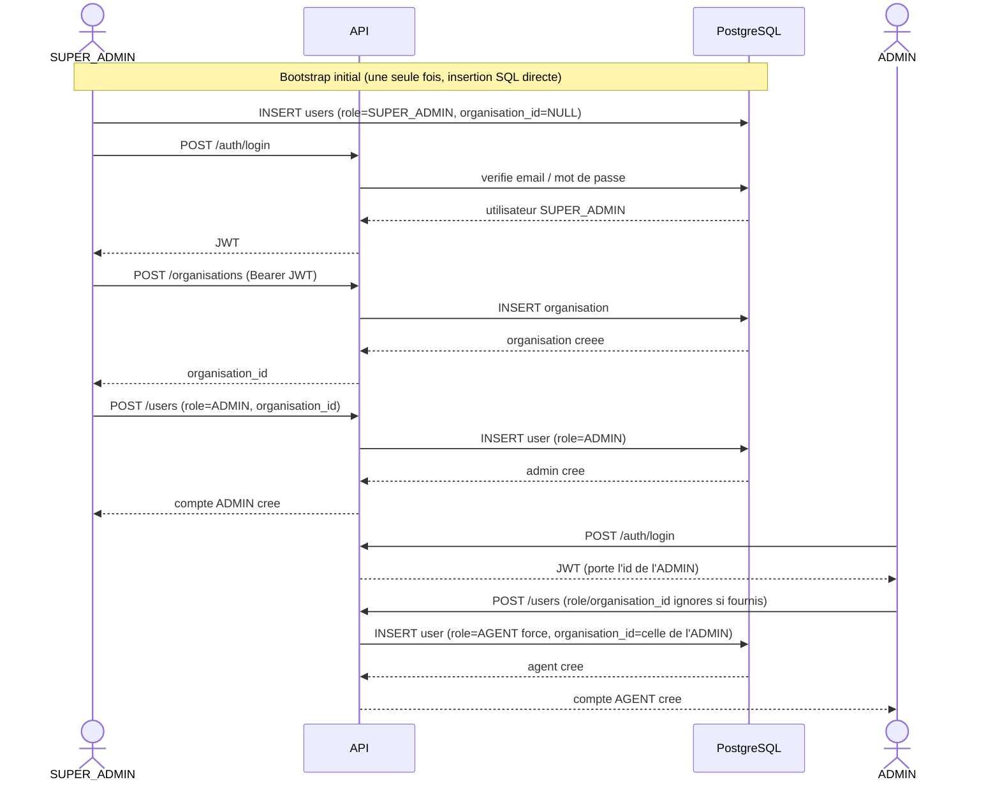
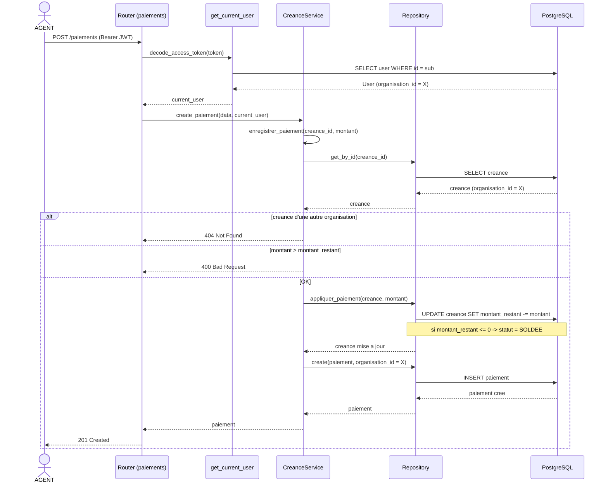
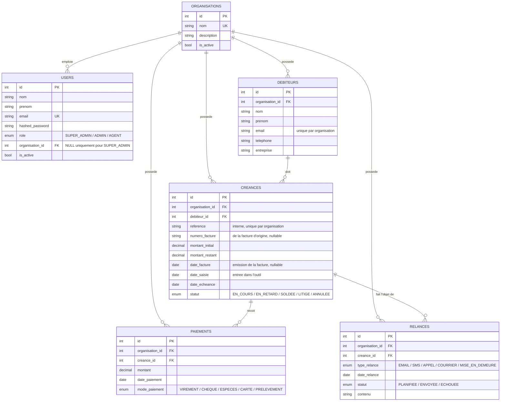

# API Recouvrement

API de recouvrement de créances, multi-tenant : plusieurs organisations (cabinets de recouvrement / entreprises) utilisent la même plateforme, chacune isolée des autres.

## Stack

- **Backend** : FastAPI (async), Python 3.12
- **Base de données** : PostgreSQL 16 (Docker, base `recouvrement_db`)
- **ORM** : SQLAlchemy 2.0 async (`asyncpg`)
- **Validation** : Pydantic v2 + `pydantic-settings`
- **Gestion de paquets** : `uv`
- **Auth** : JWT (Bearer token), mots de passe hashés avec `bcrypt`
- **Front** : Angular séparé (http://localhost:4200)
- **Admin BDD** : pgAdmin

## Architecture

Chaque domaine métier a son propre dossier sous `src/app/`, en couches :

```
router.py       → HTTP pur (endpoints), pas de logique métier
service.py      → logique métier, ne connaît pas SQLAlchemy
repository.py    → toutes les requêtes SQL
models.py       → tables SQLAlchemy
schemas.py       → validation Pydantic (entrée/sortie)
dependencies.py  → injection FastAPI (Depends)
```

Flux d'une requête : `router → service → repository → PostgreSQL`

## Domaines

| Domaine | Rôle |
|---|---|
| `organisations` | Les organisations clientes de la plateforme (tenants) |
| `users` | Comptes utilisateurs, rôles, authentification JWT |
| `debiteurs` | Les débiteurs : qui doit de l'argent |
| `creances` | Les dettes (n° et date de facture, montant, échéance, statut) |
| `paiements` | Les versements reçus sur une créance |
| `relances` | Historique des actions de recouvrement (email, SMS, appel...) |
| `ia` | Stubs pour l'analyse de dossiers / génération de messages (à développer) |

`debiteurs` sert de patron de référence pour la structure des autres domaines.

### Vocabulaire

Le domaine `debiteurs` s'appelait `clients`, ce qui prêtait à confusion : dans un
contexte de recouvrement, un « client » désigne plutôt le donneur d'ordre pour qui
on recouvre. Les termes utilisés ici :

- **débiteur** — celui qui doit de l'argent (`debiteurs`)
- **créance** — la dette elle-même (`creances`)
- **créancier** — celui à qui l'argent est dû ; aujourd'hui c'est toujours
  l'organisation elle-même, il n'y a pas encore d'entité dédiée

Le mot « client » reste accepté comme en-tête de colonne à l'import : les fichiers
que les organisations envoient l'utilisent encore pour désigner le débiteur.

## Multi-tenant et rôles

Trois rôles, hiérarchiques :

- **`SUPER_ADMIN`** — transverse à toutes les organisations. Crée les organisations et leur premier compte `ADMIN`. Lecture seule sur les données métier de toutes les organisations (ne peut pas créer directement un débiteur/une créance — il n'appartient à aucune organisation).
- **`ADMIN`** — gère sa propre organisation. Crée des comptes `AGENT` (uniquement dans sa propre organisation, même s'il essaie de spécifier autre chose). Accès complet aux débiteurs/créances/paiements/relances de son organisation.
- **`AGENT`** — travaille au quotidien dans son organisation (débiteurs, créances, paiements, relances).

**Isolation stricte** : `debiteurs`, `creances`, `paiements`, `relances` sont tous rattachés à une `organisation_id`, jamais fournie par l'appelant — toujours dérivée de l'utilisateur authentifié. Un `ADMIN`/`AGENT` ne voit jamais les données d'une autre organisation (404, pas 403, pour ne pas révéler leur existence).

### Bootstrap du premier SUPER_ADMIN

Aucune route ne permet de créer un `SUPER_ADMIN` (personne au-dessus pour l'autoriser).

**Méthode automatique (recommandée)** : définir `SUPER_ADMIN_EMAIL` et `SUPER_ADMIN_PASSWORD` dans `.env`. Au démarrage, l'app crée ce compte s'il n'existe pas encore (voir `core/bootstrap.py`, appelé depuis le `lifespan` de `main.py`) — idempotent, sans risque de doublon au redémarrage. À retirer ou changer ces variables une fois en production.

```bash
# .env
SUPER_ADMIN_EMAIL=super@platform.com
SUPER_ADMIN_PASSWORD=changeme123
```

**Méthode manuelle (alternative)** : insertion SQL directe, si on ne veut pas passer par les variables d'environnement :

```sql
-- generer le hash avec : python -c "import bcrypt; print(bcrypt.hashpw(b'ton_mot_de_passe', bcrypt.gensalt()).decode())"
INSERT INTO users (nom, prenom, email, hashed_password, role, is_active, organisation_id)
VALUES ('Root', 'Super', 'super@platform.com', '<hash_bcrypt>', 'SUPER_ADMIN', true, NULL);
```

Ensuite, via l'API, le SUPER_ADMIN peut créer des organisations (`POST /organisations`) puis leur premier `ADMIN` (`POST /users` avec `role: "ADMIN"` et `organisation_id`).

## Endpoints principaux

- `POST /auth/login` — connexion, renvoie un JWT
- `POST /users`, `GET /users`, `GET /users/me`, `GET/PATCH/DELETE /users/{id}` — gestion des comptes (scopée par organisation)
- `POST/GET/PATCH/DELETE /organisations` — réservé au `SUPER_ADMIN`
- `GET /organisations/me` / `GET /organisations/me/stats` — infos et statistiques de sa propre organisation
- `GET /organisations/{id}/stats` — statistiques d'une organisation (`SUPER_ADMIN`)
- `POST/GET/PATCH/DELETE /debiteurs` — les débiteurs
- `POST/GET/PATCH/DELETE /creances` — créances (filtrables par `?debiteur_id=`), `enregistrer_paiement` décrémente `montant_restant` et passe en `SOLDEE` à zéro
- `POST/GET /paiements`
- `POST/GET/PATCH/DELETE /relances`
- `GET /imports/creances/modele` — modèle Excel à remplir ; `POST /imports/creances/preview` valide sans écrire, `POST /imports/creances` importe

L'import accepte `.xlsx` et `.csv`, et tolère de nombreuses variantes d'en-têtes (accents,
casse, `Client`/`Débiteur`, `N° facture`/`num_facture`, `Date facture`/`Date d'émission`...).
Le numéro de facture alimente `numero_facture` ; à défaut de colonne `référence` dédiée il
sert aussi de référence interne, ce qui fait rejeter le ré-import d'un même fichier plutôt
que de créer des doublons. `date_facture` est facultative — une ligne sans elle passe, mais
si elle est renseignée elle doit précéder l'échéance.

Toutes les routes métier (hors `/auth/login` et `/health`) exigent un header `Authorization: Bearer <token>`.

Docs interactives : http://localhost:8000/docs

## Installer et lancer en local (macOS / Python)

Prérequis : Python ≥ 3.12 (vérifier avec `python3 --version`) et [`uv`](https://astral.sh/uv) comme gestionnaire de paquets.

```bash
# installer uv si absent (une seule fois)
brew install uv
```

`uv` gère lui-même la version de Python nécessaire au projet : s'il ne trouve pas de version compatible sur le système, il en télécharge une dans son propre cache, isolée du Python système. Aucune dépendance système supplémentaire n'est requise sur macOS (pas de Xcode Command Line Tools nécessaires — les libs comme `asyncpg`/`bcrypt` fournissent des wheels précompilés pour macOS).

```bash
cd backend_recouvrement

# 1. Copier le fichier d'environnement (les valeurs par defaut collent deja
#    au conteneur postgres existant, donc pas besoin de le modifier)
cp .env.example .env

# 2. Installer les dependances — cree un .venv local dans le projet
uv sync

# 3. Lancer le serveur en mode dev (--reload = redemarrage auto a chaque modif)
uv run uvicorn app.main:app --reload --app-dir src --port 8000
```

Pour activer le `.venv` dans le terminal (utiliser `python`, `pytest`... sans le prefixe `uv run`) :

```bash
source .venv/bin/activate
```

Ou via Docker (le backend seul — Postgres/pgAdmin tournent déjà en dehors du repo) :

```bash
docker compose up --build
```

- API : http://localhost:8000
- Swagger : http://localhost:8000/docs
- pgAdmin : http://localhost:5050

Une fois `uv sync` exécuté une fois, il suffit de relancer la commande `uv run uvicorn ...` aux prochains démarrages — pas besoin de re-`sync` sauf si `pyproject.toml` change.

## Diagrammes de séquence

### Onboarding d'une nouvelle organisation



### Requête métier protégée : enregistrer un paiement



### Relations entre les tables



`organisation_id` est dupliqué sur `debiteurs`, `creances`, `paiements` et `relances` (plutôt que de le déduire par jointure à chaque fois) pour que chaque requête de scoping par organisation reste une simple clause `WHERE`, sans risque d'oubli de jointure qui laisserait fuiter des données entre organisations.

## Point important : migrations

`main.py` crée les tables au démarrage via `Base.metadata.create_all` (dans le `lifespan`). C'est **provisoire** : `create_all` crée les tables manquantes mais ne modifie jamais une table existante (nouvelle colonne, contrainte...). Tant qu'Alembic n'est pas en place, tout changement de schéma nécessite de supprimer et recréer les tables concernées (perte des données de dev).

En attendant, les changements de schéma sur une base contenant déjà des données sont livrés
en SQL dans `migrations/`, à appliquer **avant** de démarrer la nouvelle version du backend :

```bash
docker exec postgres pg_dump -U recouvrement_user recouvrement_db > sauvegarde.sql
docker exec -i postgres psql -v ON_ERROR_STOP=1 -U recouvrement_user -d recouvrement_db < migrations/001_client_vers_debiteur.sql
```

| Script | Effet |
|---|---|
| `001_client_vers_debiteur.sql` | `clients` → `debiteurs`, `creances.client_id` → `debiteur_id`, `date_creation` → `date_saisie`, ajout de `numero_facture` et `date_facture` |
| `001_client_vers_debiteur_rollback.sql` | annule le script ci-dessus |

À mettre en place :

```bash
uv run alembic init migrations
# configurer migrations/env.py pour pointer sur app.core.database.Base
# et importer tous les app/*/models.py pour que les tables soient vues
uv run alembic revision --autogenerate -m "schema initial"
uv run alembic upgrade head
```

Puis retirer le `create_all` du lifespan dans `main.py`.

## Ce qui reste à faire

- [ ] Alembic (voir ci-dessus)
- [ ] Partie IA (`ia/`) : génération de messages de relance, analyse de dossiers, priorisation
- [ ] Envoi réel des relances (SMTP/SMS) — aujourd'hui `relances` n'est qu'un enregistrement manuel, rien n'est envoyé automatiquement
- [ ] Documentation du contrat d'API pour le front Angular
